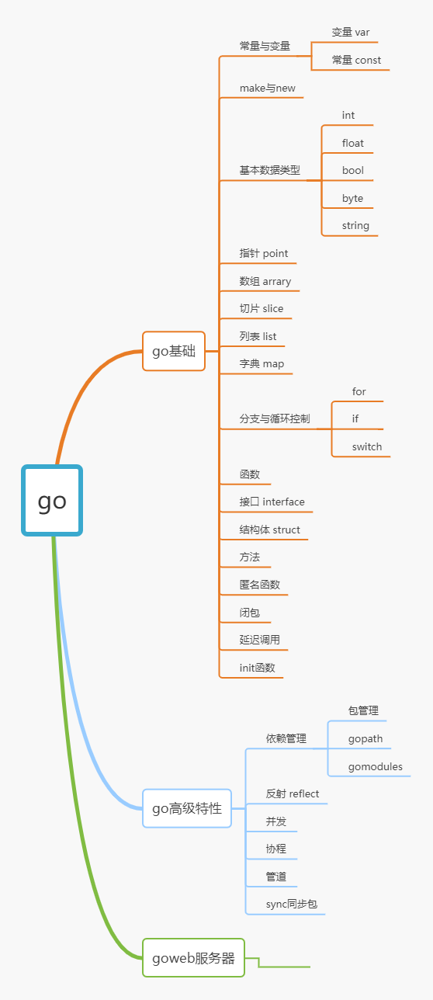
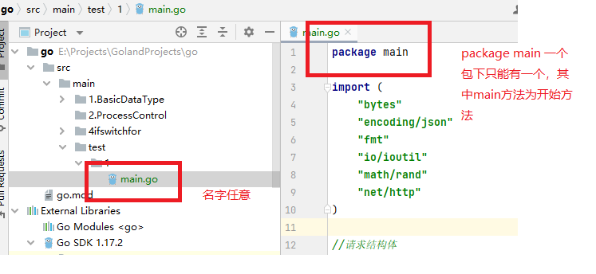
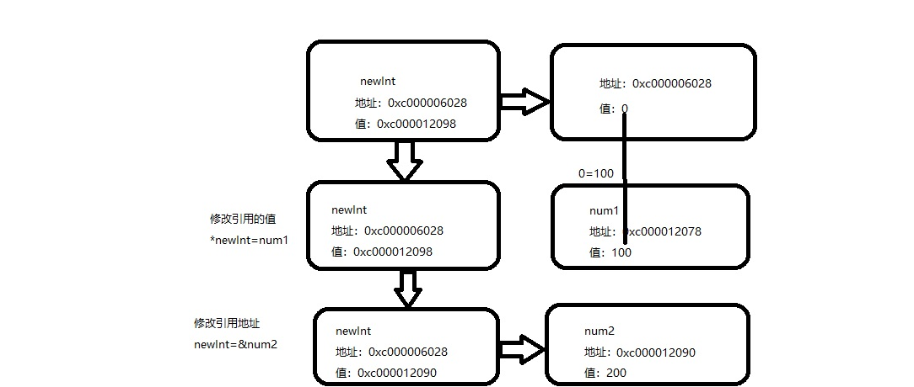

# go_study_demo
go学习笔记

在学习go语言时，可借鉴资料有：

go语言高并发和微服务实战



## go语言基础

==<u>**新人跳坑：**</u>==

在下述代码中会出现fmt.Printf 与fmt.Println不同，前者用户格式化输出，可使用占位符如%d,%v等有疑惑的码农同志们可自行查看go语言占位符

关于main包：

如下图：

go/src/main 文件下有1，2，3，4，test4个文件夹你可以理解为每个文件夹都是一个包，在go语言中，每个包下只能有一个main文件，即如test/1/mian.go， 名字可任意main.go也可以写成 student.go ，唯一要注意的是在该.go的同一文件下只能有一个标识为package main，其余全为package 1或其子文件包/文件夹名称。标识为package main表示该.go文件为该包下的唯一启动文件，其包下及其子包下不能有其他标识为pacakge main




### 1.变量与常量

与所有语言已有go语言也有变量与常量

#### 1.1变量

声明时会自动初始化，对于基本数据类型都有默认值，而引用数据类型没有

==<u>局部变量声明必须被使用，否则编译不通过</u>==

声明方式：

1. var name type   默认初始化
2. var name type=value 声明并赋值
3. var name =value   简写==2
4. name:=value          简写==2

#### 1.2常量

局部与全局声明时都必须初始化

声明方式：

1. const name type =value

2. const name =value

   

<!--代码：1.1_var_const-->

```go
package main

import (
	"fmt"
	"go/constant"
)

//var 变量值可改变，在go中每个变量声明必须被使用，否则编译不通过
//const 常量 值不可改变
type StructType struct {
	Name string
	Age  int
}

//1.2全局变量 小写开头不能被外部引用，大写开头可以，结构体定义，体内变量同样
var (
	name string
	age  int
	sex  byte
)

//2.2全局常量
const Title string = "data_type"
const p int = 20

func main() {
	//1.1局部变量，声明后默认初始化，基本数据类型有其对应的默认值
	var intType1 int
	var boolType1 bool
	var stringType1 string
	var floatType1 float64
	var mapsType1 map[string]string
	var structType1 StructType
	var sliceType1 []string
	var channelType1 chan int

	//1.3 语法糖，只对局部变量适用   data_name := value  go会根据其值类型自动适配类型
	//                    相当于   var data_name := value
	intType2 := 5
	boolType2 := true
	sliceType2 := []string{"a", "b", "c"}

	//2 常量 顾名思义必须声明时赋值
	//2.1局部常量
	const stringType2 = "220504"
	const highs int = 10

	//声明后必须被使用
	fmt.Printf("变量类型:    %T,%T,%T ,%T,%T,%T,%T,%T\n",
		intType1, boolType1, stringType1, floatType1, mapsType1, structType1, sliceType1, channelType1)
	fmt.Printf("变量默认值:  %v,%v,%v,%v,%v,%v,%v,%v\n",
		intType1, boolType1, stringType1, floatType1, mapsType1, structType1, sliceType1, channelType1)

	//全局变量默认初始化，声明后可不使用
	fmt.Println(name, age, sex)

	//语法糖模式
	fmt.Printf("变量类型:    %T,%T,%T\n",
		intType2, boolType2, sliceType2)
	fmt.Printf("变量默认值:  %v,%v,%v\n",
		intType2, boolType2, sliceType2)
}

```

### 2.make与new

为啥我要提前讲解make和new，因为你在后续学习的过程中会经常遇见他，所以我在这里提前介绍：

make和new是go语言的内置函数，他们在go中的builtin包下，可直接使用

| 內建函数 |       |         |         |
| -------- | ----- | ------- | ------- |
| make     | len   | cap     | new     |
| append   | copy  | delete  | real    |
| imag     | panic | recover | complex |

---

#### 2.1make()

make只能对slice,map,channel进行初始化

```go
func make(t Type, size ...IntegerType) Type
```

参数：  

- t Type : 传入参数类型,即参数本身
- size ...IntegerType:  ...可以理解为可以传递多个参数，第一个为长度，第二位为容量，若只有一个参数则表示长度==容量

返回值：

- Type：参数，即引用本身

因为slice,map,channel都是引用数据类型，所以传入和返回就是其本身

```go
slice1 := make([]string, 5)
	fmt.Printf("直接makeslices1地址%p,值%v,长度%d,容量%d\n", &slice1, slice1, len(slice1), cap(slice1))
	var slice2 []string
	fmt.Printf("make前slices2地址%p,值%v,长度%d,容量%d\n", &slice2, slice2, len(slice2), cap(slice2))
	slice2 = make([]string, 10, 15)
	fmt.Printf("make后slices2地址%p,值%v,长度%d,容量%d\n", &slice2, slice2, len(slice2), cap(slice2))

直接makeslices1地址0xc000004078,值[    ],长度5,容量5
make前slices2地址0xc0000040a8,值[],长度0,容量0
make后slices2地址0xc0000040a8,值[         ],长度10,容量15
```


#### 2.2new()

可对任意类型进行初始化

```go
func new(Type) *Type
```

参数：  

- t Type : 传入参数类型

返回值：

- *Type：指针


==修改值方式：==

1. 修改引用的值   *name=value
2. 修改引用的地址 name=&value

new返回的是一个指针，指向0值的指针

修改和赋值操作是对其引用的修改和赋值，因为他就是一个指针

<!--代码：1.2make_new-->

```go
num1 := 100
	num2 := 200
	newInt := new(int)
	fmt.Printf("num1的地址%p,值%v\n", &num1, num1)
	fmt.Printf("num2的地址%p,值%v\n", &num2, num2)
	//newInt本身的值保存的是引用的地址
	fmt.Printf("原始newInt:地址%p,值%v,引用的地址%p,引用的值%v\n", &newInt, newInt, &(*newInt), *newInt)
	//修改newInt的值
	//1.修改其引用的值
	*newInt = num1
	fmt.Printf("改变引用值后newInt:地址%p,值%v,引用的地址%p,引用的值%v\n", &newInt, newInt, &(*newInt), *newInt)
	//2.修改其地址，改变其引用
	newInt = &num2
	fmt.Printf("修改地址后newInt:地址%p,值%v,引用的地址%p,引用的值%v\n", &newInt, newInt, &(*newInt), *newInt)

num1的地址0xc000012078,值100
num2的地址0xc000012090,值200
原始newInt:地址0xc000006028,值0xc000012098,引用的地址0xc000012098,引用的值0
改变引用值后newInt:地址0xc000006028,值0xc000012098,引用的地址0xc000012098,引用的值100
修改地址后newInt:地址0xc000006028,值0xc000012090,引用的地址0xc000012090,引用的值200
```




注：

make和new的共同的与区别：

1. make和new都是用来初始化数据类型
2. make只能对slice，map，channel进行初始化
3. new可以对所有数据类型进行初始化
4. make返回的是引用本身
5. new返回的是一个指针

### 3.基本数据类型

#### 3.1int    

| 有符号 |     范围     | 无符号 |   范围   |
| :----: | :----------: | :----: | :------: |
|  int8  |   -128~127   | uint8  | 0-256-1  |
| int16  | -2^15~2^15-1 | uint16 | 0-2^16-1 |
| int32  | -2^31~2^31-1 | uint32 | 0-2^32-1 |
| int64  | -2^63~2^63-1 | uint64 | 0-2^64-1 |

除此之外还有 <font color=red>rune</font>和<font color=red>byte</font> 类型

为什么有rune呢？

因为golang中string底层是由byte数组实现的，8位一个字符，中文unicode编码占2字节，

而在<font color=red>utf-8中中文占3字节，即一个汉字=3个字节=3个字符，golang默认就是utf-8</font>

- rune等价于int32，常用来处理unicode或utf-8字符，32位一字节

- byte 等价于 uint8 ，常用来处理ascii字符

```go
fmt.Println(utf8.RuneCountInString(name))//9  go中通过utf8包下的方法，和rune字符串转换获取实际长度
fmt.Println(len([]rune(name)))//9  
```

高长度类型转低长度时会发生长度截取，仅保留高长度的低位值，造成转换错误

#### 3.2float

%a.bf打印精度 

a:字符串长度不足时补空格，超出了则按照实际宽度打印 

b:精度为多少

- float32   3.40282346638528859811704183484516925440e+38

- float64    1.797693134862315708145274237317043567981e+308

  float32于float64也可以转换，也会出现精度问题

  

#### 3.3bool

true false

在go中bool型无法与数值类型进行强制转换，也无法进行数值计算

#### 3.4string

字符串

string转[]byte/[]rune

a:=[]byte(string) 

a:=[]rune(string)

因为golang中string底层是由byte数组实现的，8位一个字符，中文unicode编码占2字节，

而在<font color=red>utf-8中中文占3字节，即一个汉字=3个字节=3个字符，golang默认就是utf-8</font>

- rune等价于int32，常用来处理unicode或utf-8字符，32位一字节

- byte 等价于 uint8 ，常用来处理ascii字符

  string的各种使用方法在strings中有各种函数

```go
for _,g:=range []byte(name){
   fmt.Printf("%c ",g)
}
fmt.Println("")
for _,g:=range []rune(name){
   fmt.Printf("%c ",g)
}
```

1. 如果我们保存的字符在  ASCII表的,比如[0-1,  a-z,A-Z..]直接可以保存到  byte
2. 如果我们保存的字符对应码值大于  255,这时我们可以考虑使用 int类型保存
3. 如果我们需要安装字符的方式输出，这时我们需要格式化输出，即  fmt.Printf(“%c”, c1)..
4. 字符类型是可以进行运算的，相当于一个整数，因为它都对应有

```go
var a1 int=19999
var a2 =10+'a'
fmt.Printf("%c\n",a1) //丢
fmt.Println(a2)//107
```

存储：字符--->对应码值---->二进制-->存储

二进制---->码值  ---->字符   -->读取


基本数据类型默认值

| 数据类型 | 默认值 |
| :------: | :----: |
|   int    |   0    |
|  float   |   0    |
|   bool   | false  |
|  string  |   ""   |

#### 3.5类型转换

name:=T(v)

name：转换后的值

T: 要转换的类型

v: 转换的值

int和float类型可以互相转换，转换后会出现小数点丢失

大精度转小精度，由于字节存储不同，转换后截取低的位数，会出现数据溢出


基本数据类型转string 

1.fmt.Sprintf("%参数类型"，v) 返回string类型

2.使用strconv包

```go
//基本数据类型转string
//1.使用 fmt.Sprintf()
str := fmt.Sprintf("%d", a)
fmt.Printf("str type %T str=%q\n", str, str)
str = fmt.Sprintf("%f", c)
fmt.Printf("str type %T str=%q\n", str, str)
str = fmt.Sprintf("%t", f)
fmt.Printf("str type %T str=%q\n", str, str)
str = fmt.Sprintf("%c", h)
fmt.Printf("str type %T str=%q\n", str, str)
str=strconv.FormatBool(f)
fmt.Printf(str)
```

### 4.运算符

#### 4.1算数运算符

- 算数运算符和C语言几乎一样

| 运算符 | 描述 | 实例  |
| ------ | ---- | ----- |
| +      | 相加 | A + B |
| -      | 相减 | A - B |
| *      | 相乘 | A * B |
| /      | 相除 | B / A |
| %      | 求余 | B % A |
| ++     | 自增 | A++   |
| --     | 自减 | A--   |

- 注意点:
  + 只有相同类型的数据才能进行运算

```go
package main
import "fmt"
int main(){
	var num1 int32 = 10
	//var num2 int64 = num1 // 类型不同不能进行赋值运算
	var num2 int64 = int64(num1) // 类型不同不能进行赋值运算
	fmt.Println(num2)

	var num3 int32 = 10
	var num4 int64 = 20
	//var res int64 = num3 + num4 // 类型不同不能进行算数运算
	var res1 int64 = int64(num3) + num4 // 类型不同不能进行算数运算
	fmt.Println(res1)

	var num5 int32 = 10
	var num6 int64 = 20
	//var res2 bool = (num5 == num6) // 类型不同不能进行关系运算
	var res2 bool = (num5 == int32(num6)) // 类型不同不能进行关系运算
	fmt.Println(res2)

	// ... ... 其它以此类推
}
```

+ Go语言中++、--运算符不支持前置
  + 错误写法: ++i; --i;
+ Go语言中++、--是语句,不是表达式,所以必须独占一行
  + 错误写法: a = i++;  return i++;

```go
package main
import "fmt"
func main() {
	num1 := 0
	num1++
	fmt.Println(num1)
	//++num1 // 编译报错, Go语言中++只能后置,不能前置
	//fmt.Println(num1)
	//var num2 int = num1++ // 编译报错, num1++是语句不是表达式, 所以必须独占一行
	//fmt.Println(num2)
}
```

- Go语言中字符串支持利用+号进行拼接

```go
package main
import "fmt"
func main() {
	str := "abc" + "def"
	//fmt.Println(str)
}
```

---

#### 4.2关系算符

- 关系算符和C语言一样

| 运算符 | 描述                                                         | 实例   |
| ------ | ------------------------------------------------------------ | ------ |
| ==     | 检查两个值是否相等，如果相等返回 True 否则返回 False。       | A == B |
| !=     | 检查两个值是否不相等，如果不相等返回 True 否则返回 False。   | A != B |
| >      | 检查左边值是否大于右边值，如果是返回 True 否则返回 False。   | A > B  |
| <      | 检查左边值是否小于右边值，如果是返回 True 否则返回 False。   | A < B  |
| >=     | 检查左边值是否大于等于右边值，如果是返回 True 否则返回 False。 | A >= B |
| <=     | 检查左边值是否小于等于右边值，如果是返回 True 否则返回 False。 | A <= B |

- 注意点:
  + 和C语言不通的是, Go语言中关系运算符只能返回true和false

---

#### 4.3逻辑运算符

- 逻辑运算符和C语言一样

| 运算符     | 描述                                                     | 实例     |
| ---------- | -------------------------------------------------------- | -------- |
| &&         | 如果两边的操作数都是 True，则条件 True，否则为 False。   | A && B   |
| ```\|\|``` | 如果两边的操作数有一个 True，则条件 True，否则为 False。 | A \|\| B |
| !          | 如果条件为 True，则逻辑 NOT 条件 False，否则为 True。    | !A       |

- 注意点:
  + 和C语言不通的是, Go语言中关系运算符只能返回true和false
  + 逻辑非只能用于true和false

---

#### 4.4位运算符

 - 位运算符和C语言几乎一样

| 运算符  | 描述                                                         | 实例   |
| ------- | ------------------------------------------------------------ | ------ |
| &       | 二进位相与, 全1为1，其余为0   ==&& 只对1来说，都是真成立     | A & B  |
| ```|``` | 二进位相或,有1为1，其余为0    ==\|\|  只对1来说，有一个则为真 | A \| B |
| ^       | 二进位相异或,对应位只要不同，结果就是1                       | A ^ B  |
| <<      | 左移运算符,左移n位就是乘以2的n次方                           | A << 2 |
| >>      | 右移运算符,右移n位就是除以2的n次方                           | B >> 2 |
| &^      | 逻辑清零运算符, B对应位是1,A对应位清零,B对应位是0, A对应位保留原样 | A &^ B |

 + 新增一个&^运算符

```c
int main(){
	/*
	  0110      a
	&^1011      b 如果b位位1,那么结果为0, 否则结果为a位对应的值
	----------
	  0100
	*/
	a1 := 6
	b1 := 11
	res1 := a1 &^ b1
	fmt.Println("res1 = ", res1) // 4

	/*
	  1011      a
	&^1101      b 如果b位位1,那么结果为0, 否则结果为a位对应的值
	----------
	  0010
	*/
	a2 := 11
	b2 := 13
	res2 := a2 &^ b2
	fmt.Println("res2 = ", res2) // 2
}
```

---

#### 4.5赋值运算符

- 赋值运算符和C语言几乎一样
  +  新增一个&^=运算符

| 运算符    | 描述             | 实例                                  |
| --------- | ---------------- | ------------------------------------- |
| =         | 将右边赋值给左边 | C = A + B 将 A + B 表达式结果赋值给 C |
| +=        | 相加后再赋值     | C += A 等于 C = C + A                 |
| -=        | 相减后再赋值     | C -= A 等于 C = C - A                 |
| *=        | 相乘后再赋值     | C *= A 等于 C = C * A                 |
| /=        | 相除后再赋值     | C /= A 等于 C = C / A                 |
| %=        | 求余后再赋值     | C %= A 等于 C = C % A                 |
| <<=       | 左移赋值         | C <<= 2 等于 C = C << 2               |
| >>=       | 右移赋值         | C >>= 2 等于 C = C >> 2               |
| &=        | 位逻辑与赋值     | C &= 2 等于 C = C & 2                 |
| ^=        | 位逻辑或赋值     | C ^= 2 等于 C = C ^ 2                 |
| ```\|=``` | 位逻辑异或赋值   | C \|= 2 等于 C = C \| 2               |
| &^=       | 位逻辑清零赋值   | C &^= 2 等于 C = C &^ 2               |

---

#### 4.6其它运算符

| 运算符 | 描述             | 实例                     |
| ------ | ---------------- | ------------------------ |
| &      | 返回变量存储地址 | &a; 将给出变量的实际地址 |
| *      | 访问指针指向内存 | *p; 访问指针p指向内存    |

```go
package main
import "fmt"
int main(){
	var num int = 666
	var p *int = &num
	fmt.Println(num)
	fmt.Println(*p)
	num = 777
	fmt.Println(num)
	*p = 999
	fmt.Println(num)
}
```

- 注意点
  - 指针类型只支持相等运算, 不能做加减运算

```c
#include <stdio.h>
int main()
{
    int ages[3] = {19, 23, 22};
    int *arrayP = &ages[0];
    printf("ages[0] = %i\n", *(arrayP + 0)); // *(arrayP + 0) == *arrayP
    printf("ages[1] = %i\n", *(arrayP + 1));
    printf("ages[2] = %i\n", *(arrayP + 2));
    return 0;
}
```

```go
package main
import "fmt"
int main(){
	var ages [3]int = [3]int{19, 23, 22}
	var p *int = &ages[0]
	//fmt.Println(&ages[0])
	//fmt.Println(*p) // 19
	fmt.Println(*(p + 0)) // 编译报错
}
```

#### 4.7运算符优先级

- 和C语言一样, 只需记住()优先级最高即可

### 5.循环与分支

#### 5.1 if--选择分支

- 和C语言不同的的是
  + 条件表达式的值必须是布尔类型(Go语言中没有非零即真的概念)
  + 条件表达式前面可以添加初始化语句
  + 不需要编写圆括号
  + 左大括号必须和条件语句在同一行
- 第一种格式:
  + 条件表达式结果为true,那么执行if后面{}中代码

```
if 初始化语句; 条件表达式{
    语句块;
}else if 条件表达式{

}else{

}
```

```
package main
import "fmt"
func main() {
	// 如果后续需要用到age变量, 可以将变量放到if外面
	age := 18
	if age >= 18{
		fmt.Println("成年人")
	}
}
```

```
package main
import "fmt"
func main() {
	// 如果后续不需要用到age变量, 可以将变量放到条件表达式前面
	if age := 18; age >= 18{
		fmt.Println("成年人")
	}
}
```

#### 5.2 switch--选择结构

注意：

switch中每个case中自带break，要实现穿透，使用fallthrough

一个case后面可以有多个表达式, 满足其中一个就算匹配

格式：

```
switch 初始化语句; 表达式{
  case 表达式1, 表达式2:
        语句块;
  case 表达式1, 表达式2:
        语句块;
  default:
        语句块;
}
```

```go
package main

import "fmt"

func main() {
   month := 0
   fmt.Scanln(&month)
   switch month {
   case 1:fallthrough  //如不加fallthrough则直接跳出，因为go中case自带break
   case 2:fallthrough
   case 3:
      fmt.Println("春季")
   case 4, 5, 6:
      fmt.Println("夏季")
   case 7, 8, 9:
      fmt.Println("秋季")
   case 10, 11, 12:
      fmt.Println("冬季")
   default:
      fmt.Println("不存在该月份")

   }

}
```

#### 5.3for--循环控制==while

结构：

```
for 初始化表达式；循环条件表达式；循环后的操作表达式 {
    循环体语句;
}
while==for 条件表达式{

}
```

go通过len(v)获取长度，cap(v)获取容量

```go
package main

import "fmt"

func main() {
   name:=[]string{"你好","hello","yes"}
   for i := 0; i < len(name); i++ {
      fmt.Println(name[i])
   }
   i:=0
   for i<len(name) {//==while
      fmt.Println(name[i])
      i++
   }
}
```

除了实现基本的循环结构以外,Go语言还实现了一种高级for循环`for...range循环`

for...range循环`可以快速完成对字符串、数组、slice、map、channel遍历


格式

```go
for 索引, 值 := range 被遍历数据{
}
```

其中 索引，值都可以使用占位符_，进行占位，没有任何意义，仅仅起到占位的作用

```go
for _,v:=range name{
   fmt.Println(v)
}
```

### 6.四大跳转

- 和C语言一样,Go语言中也有四大跳转语句, 分别是return、break、continue、goto
- break语句
  + Go语言中的break语句可以用于,立即跳出switch、for和select
  + 但不同的是Go语言中的break语句可以指定标签

```go
package main
import "fmt"
func main() {
	for i:=0; i<10; i++{
		if(i == 5){
			break // 跳出所在循环
		}
		fmt.Println(i)
	}
}
```

- 利用break跳转到指定标签
  + 标签必须在使用之前定义
  + 标签后面只能跟switch和循环语句, 不能插入其它语句
  + 跳转到标签之后switch和循环不会再次被执行

```go
package main
import "fmt"
func main() {
outer:
	switch num:=2; num {
	case 1:
		fmt.Println(1)
	case 2:
		fmt.Println(2)
		break outer
	default:
		fmt.Println("other")
	}
	fmt.Println("come here")
}
```

```go
package main
import "fmt"
func main() {
outer:
	for i:=0; i<5; i++{
		for j:=0; j<10; j++ {
			if (j == 5) {
				break outer// 跳出到指定标签
			}
			fmt.Println(j)
		}
	}
	fmt.Println("come here")
}
```

- continue语句
  + Go语言中的continue语句可以用于,立即进入下一次循环
  + 但不同的是Go语言中的continue语句可以指定标签

```go
package main
import "fmt"
func main() {
	for i:=0; i<5; i++{
		if (i == 2) {
			continue
		}
		fmt.Println(i)
	}
}
```

- 利用continue 跳转到指定标签
  + 标签必须在使用之前定义
  + 标签后面只能跟循环语句, 不能插入其它语句
  + 对于单层循环和直接编写continue一样
  + 对于多层循环,相当于跳到最外层循环继续判断条件执行

```go
package main
import "fmt"
func main() {
outer:
	for i:=0; i<5; i++{
		fmt.Println("i =", i) // 0 1 2 3 4
		for j:=0; j<10; j++ {
			if (j == 5) {
				continue outer// 跳出到指定标签
			}
		}
	}
	fmt.Println("come here")
}
```

- goto语句
  + Go语言中的goto和C语言中用法一样, 用于在同一个函数中瞎跳

```go
package main
import "fmt"
func main() {
	num := 1
outer:
	if(num <= 10){
		fmt.Println(num)
		num++
		goto outer // 死循环
	}
	fmt.Println("come here")
}
```

```go
package main
import "fmt"
func main() {
	num := 1
	if(num <= 10){
		fmt.Println(num)
		num++
		goto outer // 死循环
	}
outer:
	fmt.Println("come here")
}
```

- Go语言中的return语句和C语言一模一样,都是用于结束函数,将结果返回给调用者